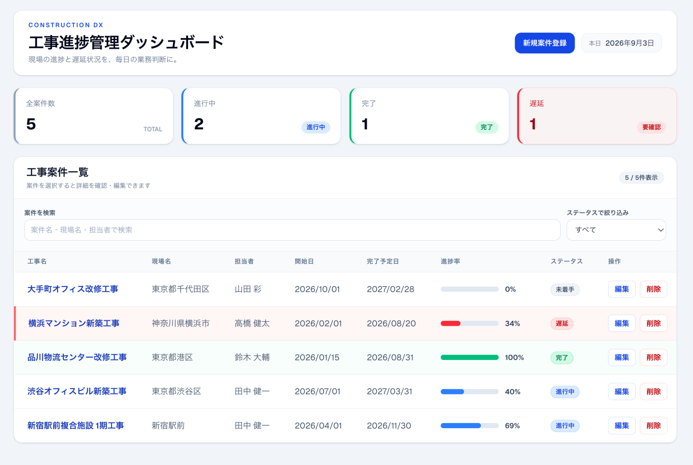
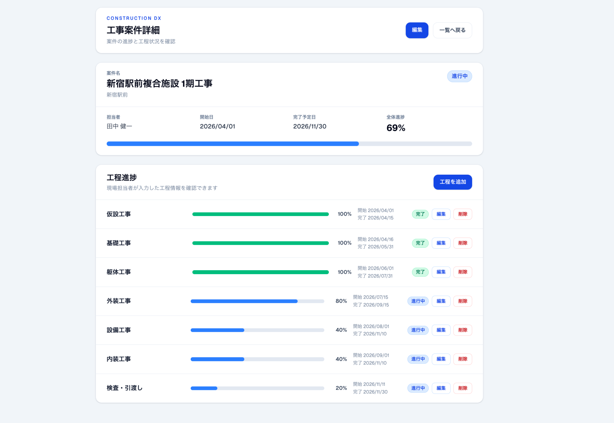

# Construction DX

建設会社向け工事進捗管理Webアプリケーションです。

現場担当者による工程進捗の更新から、管理者による複数案件の進捗・遅延状況の把握までを一元化することを想定して設計・開発しました。

**公開URL:** [https://construction-dx-lyart.vercel.app](https://construction-dx-lyart.vercel.app)

## 画面イメージ

### ダッシュボード

複数案件の進捗・ステータスを一覧で確認できます。
検索・ステータス絞り込みに加え、進行中・完了・遅延などの状況を
ダッシュボードから把握できます。



### 案件詳細・工程進捗

案件ごとの基本情報と、各工程の予定日・進捗率・ステータスを確認できます。
工程進捗を更新すると、その情報をもとに案件全体の進捗率・ステータスを自動算出します。



## 想定した業務課題

本ポートフォリオでは、建設会社の工事管理を次のような課題がある業務として想定しました。

- 案件情報や工程進捗がExcelや個別ファイルに分散する
- 管理者が複数案件の最新状況を把握しにくい
- 案件全体進捗と個別工程進捗を別々に入力すると不整合が発生する
- 案件ごとに基本工程を毎回登録するのは手間がかかる
- 遅れている案件・工程を把握するのに時間がかかる

## 解決方針

上記の課題に対し、案件と工程情報をWebシステムで一元管理する設計にしました。

- 新規案件登録時に標準7工程を自動生成
- 現場担当者が各工程の進捗、予定日、備考を更新
- 工程進捗から案件全体進捗を自動算出
- 進捗率と完了予定日から案件ステータスを自動判定
- 遅延案件と要確認工程を控えめな警告表示で可視化
- 検索とステータス絞り込みで管理者の確認負荷を軽減

## 想定業務フロー

```text
管理者または担当者
        ↓
新規案件登録
        ↓
標準工程を自動生成
        ↓
現場担当者が工程進捗を更新
        ↓
Supabaseへ保存
        ↓
案件全体進捗を自動再計算
        ↓
案件ステータスを自動判定
        ↓
管理者がダッシュボード・案件詳細から確認
```

## 主な機能

- 案件の新規登録
- 案件情報の編集・削除
- 案件詳細画面
- 案件名・現場名・担当者による部分一致検索
- ステータス絞り込み
- 全案件数、進行中、完了、遅延のダッシュボード表示
- 新規案件登録時の標準7工程自動生成
- 工程の追加・編集・削除
- 工程名、予定日、進捗率、ステータス、備考の管理
- 工程進捗からの案件全体進捗自動算出
- 案件ステータス自動判定
- 完了予定日を超過した工程の要確認表示
- PC向けテーブル表示とスマートフォン向けカード表示
- Supabaseによるデータ永続化

## 標準工程

新規案件登録時に、次の7工程を自動生成します。

1. 仮設工事
2. 基礎工事
3. 躯体工事
4. 外装工事
5. 設備工事
6. 内装工事
7. 検査・引渡し

標準工程は入力負荷を減らすためのひな形です。案件ごとに工程の追加・編集・削除ができるため、標準化による作業削減と、案件ごとの差異への柔軟な対応を両立しています。

## 全体進捗の自動算出

案件全体の進捗率は手入力せず、`construction_phases`に登録された各工程の`progress`から単純平均で算出します。

例えば、工程の進捗が次の場合です。

```text
100%, 80%, 40%, 0%, 0%, 0%, 0%
```

```text
(100 + 80 + 40 + 0 + 0 + 0 + 0) / 7 = 31.4...
```

表示時は整数へ丸めます。今回はポートフォリオとして分かりやすい簡易モデルとして等重みで算出しています。実運用では、工程ごとの工数・重要度などを考慮したウェイトによる加重平均への拡張を想定しています。

## ステータス自動判定

案件ステータスは、案件全体の進捗率と完了予定日から自動判定します。完了予定日超過を最優先します。

- 完了予定日を超過し、進捗率が100%未満: `遅延`
- 進捗率0%: `未着手`
- 進捗率1〜99%: `進行中`
- 進捗率100%: `完了`

案件ステータスを手入力させないことで、工程進捗との不整合を防止しています。

工程側のステータスも進捗率から自動補正します。

- 進捗率0%: `未着手`
- 進捗率1〜99%: `進行中`
- 進捗率100%: `完了`
- 完了予定日を超過し、進捗率が100%未満: `要確認`

工程の`要確認`は案件ステータスの`遅延`とは別に扱います。

## データ構造

案件と工程は、`construction_phases.project_id`で紐付けています。

```text
projects
   1
   ↓
   N
construction_phases
```

案件情報を親となる`projects`で管理し、複数の工程を`construction_phases`で管理する構成です。

## 使用技術

### Frontend

- Next.js
- TypeScript
- Tailwind CSS

### Backend / Database

- Supabase

### Infrastructure

- Vercel

### Version Control

- Git / GitHub

## 工夫した点

### 二重入力の削減

案件全体の進捗率を別途入力させず、現場担当者が入力した工程進捗から自動算出することで、入力作業を減らしています。

### データ不整合の防止

案件ステータスを進捗率と完了予定日から自動判定し、工程の状態と案件全体の状態が食い違いにくい設計にしています。

### 標準化と柔軟性

新規案件には標準工程を自動生成しつつ、案件ごとに工程を追加・編集・削除できます。

### 遅延の可視化

完了予定日を超過した未完了案件は`遅延`、工程は`要確認`として表示し、管理者が確認すべき対象を見つけやすくしています。

### 管理者視点

ダッシュボードのKPI、検索、ステータス絞り込み、案件詳細を組み合わせ、複数案件の状況を短時間で確認できるようにしています。

## ポートフォリオとしての位置付け

この作品では、高度なアルゴリズムを実装することよりも、想定した業務課題を整理し、要件へ落とし込み、実際に操作可能なWebアプリケーションとして実装することを重視しました。

現場担当者の入力を起点に、データ保存、進捗の自動集計、遅延判定、管理者の確認までを一つの業務フローとして設計しています。

## 今後の改善案

- Supabase Authによるログイン
- 管理者・現場担当者などの権限管理
- 工程ウェイトを使った全体進捗の加重平均
- 工程テンプレートの複数パターン化
- 更新履歴・操作ログ
- ダッシュボードのグラフ表示

## セキュリティ上の注意

現在はデモ用途として操作を試せるよう、匿名アクセスを許可しています。

本番運用では、Supabase AuthとRLSを組み合わせ、ユーザー、役割、所属案件などに応じた権限制御を行う構成を想定しています。

SupabaseのURLやキーなどの接続情報はREADMEに記載せず、環境変数で管理します。

## セットアップ

`.env.local`に以下の環境変数を設定してください。値は公開しないでください。

```env
NEXT_PUBLIC_SUPABASE_URL=your-supabase-url
NEXT_PUBLIC_SUPABASE_PUBLISHABLE_KEY=your-supabase-publishable-key
```

依存関係をインストールして開発サーバーを起動します。

```bash
npm install
npm run dev
```

ブラウザで [http://localhost:3000](http://localhost:3000) を開きます。

## ビルド確認

```bash
npm run build
```

## GitHub

このリポジトリでソースコードを公開しています。
